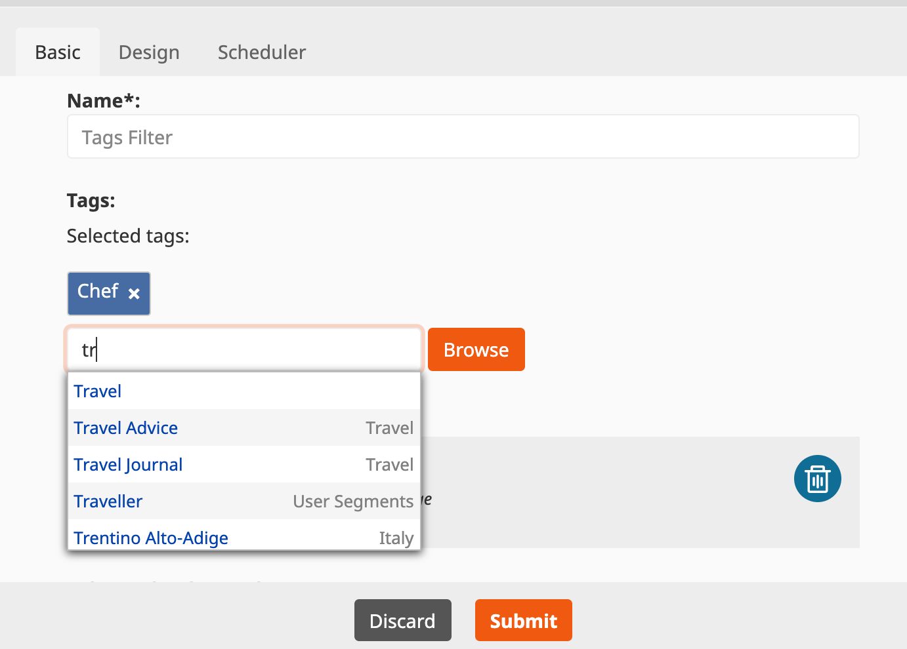

# BlockTagAttributeTypeBundle for eZ Platform LandingPage blocks

This bundle allows you to add a new attribute type `tags` to the block definition. It requires the [NetgenTags Bundle](https://github.com/netgen/TagsBundle).

You can find the available attribute types in eZPlatform here: https://doc.ezplatform.com/en/latest/extending/extending_page/#creating-custom-page-blocks)

## Requirement

- Ez Platform **Enterprise** 3+

## Installation 

```
composer require arfaram/eztagsattributetype
```

Add below line to `bundles.php`

```
EzPlatform\BlockTagAttributeTypeBundle\EzPlatformBlockTagAttributeTypeBundle::class => ['all' => true],

```

## Usage

Block configuration example:

```
blocks:
    myblockidentifier:
        #...
        attributes:
            tags:
                type: tags

```

You can also additional options:

```
                type: 'tags'
                options:
                    max_tags: 3 # max number of added tags 
                    max_results: 3  # max results in the drop-down list
                    subtree_limit: 513 # restrict access to a specific location in the keywords tree
                    hide_root_tag: true # hide root tag
                    edit_view: 'Default' # or 'Select'. ('Default' per default)
```

- Default View



- Select View


Below is an example on how to access the data in a custom [BlockListener](https://doc.ezplatform.com/en/latest/extending/extending_page/#creating-custom-page-blocks).

```
$blockValue = $event->getBlockValue();
$tagsValue = json_decode($blockValue->getAttribute('tags')->getValue(), true);

```

## Example: Profiler Block

https://github.com/arfaram/ezprofilerblock
